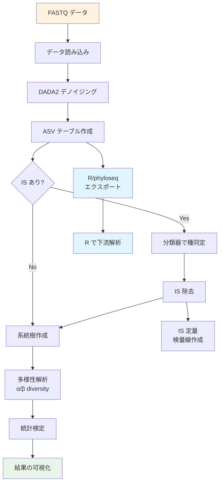

# QIIME 2 解析マニュアル

[](https://qiime2.org)
[](https://www.arb-silva.de/)
[](https://creativecommons.org/licenses/by-nc-sa/4.0/)

16S rRNA アンプリコンシーケンス解析のための包括的マニュアル（日本語）

## 概要

本マニュアルは、QIIME 2 を用いた腸内細菌叢の 16S rRNA 遺伝子解析を **コピー＆ペーストで実行可能** にすることを目指したものです。内部標準（IS）を用いた絶対定量ワークフローを含む、ラボで実際に使用されている解析パイプラインを詳細に記載しています。

> **Original manual by:** 佐藤翼（based on work by 月見友哉）  
> **Updated & published by:** [Rhizobium-gits](https://github.com/Rhizobium-gits)

## 対応環境

| 項目 | バージョン |
|------|-----------|
| QIIME 2 | 2026.1 (amplicon distribution) |
| リファレンスDB | SILVA 138.2 (SSURef NR99) |
| Python | 3.10 |
| OS | macOS (Intel/Apple Silicon), Linux, Windows (WSL2) |

## マニュアル構成

```
docs/
├── 00_introduction.md          # はじめに・メタ16S解析の概要
├── 01_installation.md          # インストール方法
├── 02_data_import.md           # データの読み込み
├── 03_quality_control.md       # クオリティーコントロール（DADA2）
├── 04_visualization.md         # QC結果の可視化
├── 05_sample_rename.md         # サンプル名の変更
├── 06_feature_table.md         # Feature tableの作成
├── 07_phylogenetic_tree.md     # 系統樹作成
├── 08_diversity.md             # 多様性解析（α/β）
├── 09_rarefaction.md           # Rarefaction curve
├── 10_classifier.md            # 分類器作成（SILVA 138.2）
├── 11_taxonomy.md              # 細菌種同定
├── 12_is_removal.md            # 内部標準（IS）の除去
├── 13_is_diversity.md          # IS除去後の多様性解析
├── 14_is_quantification.md     # IS検量線・絶対定量
├── 15_negative_control.md      # ネガティブコントロール除去
├── 16_statistical_testing.md   # 統計検定・可視化
├── 17_multi_run.md             # マルチラン処理・サンプル結合
├── 18_export_to_r.md           # R/phyloseqへのエクスポート（NEW）
├── 19_utilities.md             # ユーティリティ（ファイル名変更等）
├── 20_provenance.md            # 解析のトレース
├── 21_troubleshooting.md       # トラブルシューティング（NEW）
├── appendix_metadata.md        # Appendix: メタデータ仕様
├── appendix_changelog.md       # 変更履歴
└── figures/                    # 図・ダイアグラム
    ├── workflow_overview.mmd
    ├── workflow_is.mmd
    ├── dada2_concept.mmd
    └── r_export_workflow.mmd
```

## クイックスタート

```bash
# QIIME 2 2026.1 のインストール（macOS/Linux）
wget https://data.qiime2.org/distro/amplicon/qiime2-amplicon-2026.1-py310-linux-conda.yml
conda env create -n qiime2-2026.1 --file qiime2-amplicon-2026.1-py310-linux-conda.yml
conda activate qiime2-2026.1
```

## 解析フローチャート



## 旧マニュアルからの主な変更点

| 項目 | 旧マニュアル (2019.7) | 本マニュアル (2026.1) |
|------|----------------------|----------------------|
| QIIME 2 バージョン | 2019.7 | 2026.1 |
| リファレンスDB | SILVA 132 | SILVA 138.2 |
| DB取得方法 | 手動ダウンロード | RESCRIPt プラグイン |
| Windows環境 | VirtualBox | WSL2 |
| macOS | Intel のみ | Intel + Apple Silicon |
| 下流解析 | QIIME 2 完結 | R/phyloseq連携を追加 |
| 組成データ解析 | なし | ANCOM-BC, CLR変換の解説 |
| Provenance | 基本説明 | View改善・エラー検出 |

## 引用

QIIME 2 を使用した研究を発表する際は、以下を引用してください：

- Bolyen, E., et al. (2019). Reproducible, interactive, scalable and extensible microbiome data science using QIIME 2. *Nature Biotechnology*, 37, 852–857.
- SILVA: Quast, C., et al. (2013). The SILVA ribosomal RNA gene database project. *Nucleic Acids Research*, 41(D1), D590–D596.
- DADA2: Callahan, B.J., et al. (2016). DADA2: High-resolution sample inference from Illumina amplicon data. *Nature Methods*, 13, 581–583.

## ライセンス

本マニュアルは [CC BY-NC-SA 4.0](https://creativecommons.org/licenses/by-nc-sa/4.0/) ライセンスの下で公開されています。

## コントリビューション

Issue や Pull Request は歓迎します。改善提案やエラー報告は [Issues](../../issues) からお願いします。
