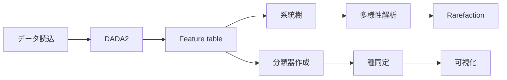
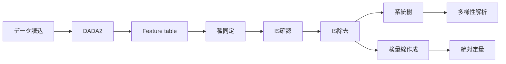

# QIIME 2 解析マニュアル

> 作成日：2026/02/19  
> 最終更新日：2026/02/23  
> 原著者：佐藤翼（Based on work by 月見友哉）  
> 更新：Rhizobium-gits

---

## はじめに

（実験医学2020.1月号より改変）

20世紀の細菌研究は菌の単離や培養に主眼が置かれ、数多くの菌が単離されてきた。しかしながら、現在でも全ての細菌を実験室で単離・培養できるわけではなく難培養性の細菌も多数存在する。一方、20世紀後半になると遺伝子クローニング技術により、16S rRNA 遺伝子に基づき菌を分類することが可能となった。そして21世紀に入ると、超並列シーケンサーの登場により、遺伝子配列解析は低コスト化・ハイスループット化した。現在では細菌叢の16S rRNA 遺伝子の網羅的解析（メタ16S 解析）、さらには細菌叢ゲノムの網羅的解析（メタゲノム解析）が細菌叢研究に用いられている。

## メタ16S 解析とは

（実験医学2020.1月号より改変）

QIIME 2 が想定しているメタ16S 解析の原理を紹介する。16S rRNA 遺伝子は細菌が有する約1,600塩基の配列である。Woeseらによってこの遺伝子配列を系統分類に利用することが提唱され、現在まで利用されている。16S rRNA 遺伝子は変異の入りやすい領域が保存領域に挟まれているため、PCR法によって増幅することができる。9つの可変領域のうち細菌叢解析ではV3からV4領域が用いられることが多いが、例えば腸内細菌叢解析においてはV1からV2領域も用いられるため、研究目的に適した増幅領域を選定することが重要である。

メタ16S 解析は、PCR法によりDNAを増幅することができるため、少量のDNAでも実施でき、かつコストがメタゲノム解析と比べると安価な点などのメリットがある。一方、PCR法による増幅バイアスや16S rRNA 遺伝子の部分配列のみでは細菌種や株の同定が難しい点には注意する必要がある。

メタ16S 解析の流れは、①サンプルからのDNA抽出およびPCR法による目的領域の増幅、②ライブラリー調製、③シーケンシング、④データ解析、の4つに大別できる。

## QIIME 2 について

QIIME 2 は2017年から公開されているマイクロバイオーム解析プラットフォームである。2019年に Nature Biotechnology 誌にて論文が発表され、現在では被引用数は数千件に達している。QIIME 1 と比較してQIIME 2 は解析パイプラインが視覚化でき、利便性が向上している。QIIME 1 からQIIME 2 へのバージョンアップによって出力ファイル形式やコマンドが刷新されており、QIIME 2 はQIIME 1 とは別のツールと考えた方が良い。

> **Note**: 2026.1リリースより、QIIME 2 のフレームワークは「rachis」にリネームされている。コマンドインターフェース自体に大きな変更はないが、内部のパッケージ名が変更されている点に注意。

## マニュアルコンセプト

- **コピー＆ペーストで解析が可能**
- 中身の挙動を詳細に記載
- テキスト出力までをコマンドで実行しているため、QIIME 2 が想定しているよりコマンド数は多い
- **QIIME 2 → R 連携**のワークフローも新たに記載

> **対応バージョン**: QIIME 2 2026.1 (amplicon distribution)  
> ※旧バージョン（2019.7〜2024.x）でもコマンドの基本構造は同様だが、一部パラメータ名の変更がある

## 解析の流れ

### ISなしの場合

データの読み込み → クオリティーコントロール（DADA2） → Feature table 作成 → 代表配列の系統樹作成 → 多様性算出 → （分類器作成）→ Rarefaction curve 算出 → 細菌種同定

### ISありの場合

データの読み込み → クオリティーコントロール → Feature table 作成 → （分類器作成）→ 細菌種同定 → IS確認 → IS除去 → Feature table 作成 → 系統樹作成 → 多様性算出 → Rarefaction curve → 検量線作成 → コピー数定量

## QIIME 1 との差異

| QIIME 1 | QIIME 2 |
|---------|---------|
| mapping ファイル | metadata ファイル |
| otu_table | table |
| OTU | feature (ASV) |
| 97% OTU | 100% OTU = ユニーク配列 (ASV) |
| .fasta（中身を操作できる） | .qza（中身を操作できない） |
| トレース不可 | Provenance によりトレース可能 |

---

**次のセクション**: [01. インストール](01_installation.md)
