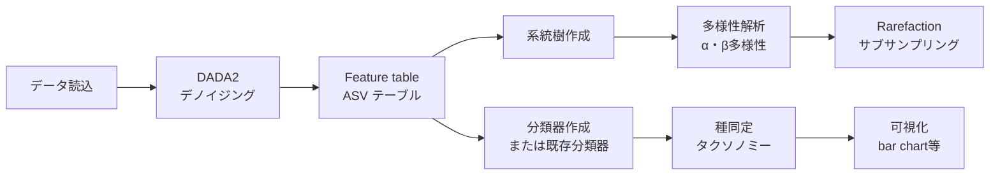
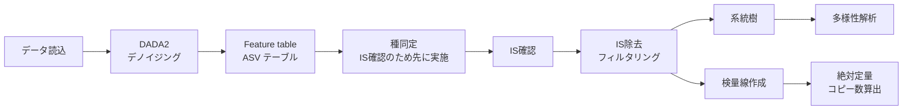

# QIIME 2 解析マニュアル

> 作成日：2026/02/19
> 最終更新日：2026/03/25
> 原著者：佐藤翼（Based on work by 月見友哉）
> 更新：Rhizobium-gits

---

## はじめに

（実験医学2020.1月号より改変）

20世紀の細菌研究は菌の単離や培養に主眼が置かれ、数多くの菌が単離されてきた。しかしながら、現在でも全ての細菌を実験室で単離・培養できるわけではなく難培養性の細菌も多数存在する。一方、20世紀後半になると遺伝子クローニング技術により、16S rRNA 遺伝子に基づき菌を分類することが可能となった。そして21世紀に入ると、超並列シーケンサーの登場により、遺伝子配列解析は低コスト化・ハイスループット化した。現在では細菌叢の16S rRNA 遺伝子の網羅的解析（メタ16S 解析）、さらには細菌叢ゲノムの網羅的解析（メタゲノム解析）が細菌叢研究に用いられている。

## メタ16S 解析とは

（実験医学2020.1月号より改変）

QIIME 2 が想定しているメタ16S 解析の原理を紹介する。16S rRNA 遺伝子は細菌が有する約1,600塩基の配列である。Woeseらによってこの遺伝子配列を系統分類に利用することが提唱され、現在まで利用されている。16S rRNA 遺伝子は変異の入りやすい領域が保存領域に挟まれているため、PCR法によって増幅することができる。9つの可変領域のうち細菌叢解析ではV3からV4領域が用いられることが多いが、例えば腸内細菌叢解析においてはV1からV2領域も用いられるため、研究目的に適した増幅領域を選定することが重要である。

メタ16S 解析は、PCR法によりDNAを増幅することができるため、少量のDNAでも実施でき、かつコストがメタゲノム解析と比べると安価な点などのメリットがある。一方、PCR法による増幅バイアスや16S rRNA 遺伝子の部分配列のみでは細菌種や株の同定が難しい点には注意する必要がある。

メタ16S 解析の流れは、①サンプルからのDNA抽出およびPCR法による目的領域の増幅、②ライブラリー調製、③シーケンシング、④データ解析、の4つに大別できる。

## QIIME 2 について

QIIME 2 は2017年から公開されているマイクロバイオーム解析プラットフォームである。2019年に Nature Biotechnology 誌にて論文が発表され、現在では被引用数は数千件に達している。QIIME 1 と比較してQIIME 2 は解析パイプラインが視覚化でき、利便性が向上している。QIIME 1 からQIIME 2 へのバージョンアップによって出力ファイル形式やコマンドが刷新されており、QIIME 2 はQIIME 1 とは別のツールと考えた方が良い。

### rachis へのリブランド（2026.1〜）

2026.1 リリースより、QIIME 2 の内部フレームワークが「**rachis**」にリネームされた。これはコアとなるアーキテクチャの整理・近代化に伴う変更であり、ユーザーが日常的に使用するコマンドラインインターフェース（`qiime` コマンド）に大きな変更はない。ただし、Python API を直接利用している場合やプラグイン開発を行っている場合は、内部パッケージ名の変更（`qiime2.*` → `rachis.*` への移行）に注意が必要である。

### 新しいドキュメントサイト

| サイト | URL | 内容 |
|--------|-----|------|
| amplicon-docs | [amplicon-docs.qiime2.org](https://amplicon-docs.qiime2.org) | アンプリコン解析チュートリアル |
| library | [library.qiime2.org](https://library.qiime2.org) | プラグイン・データベースのカタログ |
| use | [use.qiime2.org](https://use.qiime2.org) | インターフェース別の使い方ガイド |

従来の `docs.qiime2.org` に加え、これらのサイトも適宜参照されたい。

> **Note（2026.1 予定）**: 2026.1 リリースより、ディストリビューション名が `amplicon` から `qiime2` に変更される予定である。インストール用の conda 環境名やコンテナ名が変わるため、アップグレード時は公式ドキュメントを確認すること。

> **対応バージョン**: QIIME 2 2026.1 (amplicon distribution)
> ※旧バージョン（2019.7〜2024.x）でもコマンドの基本構造は同様だが、一部パラメータ名の変更がある

## 本マニュアルの方針

従来のマニュアルはコマンドのコピー＆ペーストで解析を完了させることを主眼に置いていた。本改訂版では、**各解析ステップで「何をしているのか」「なぜそれを行うのか」を理解しながら進める**ことを方針とする。

具体的には各チャプターに以下の視点を加えている：

- **解析の概要**: そのステップで何を行っているか
- **メリット・デメリット**: その手法の強みと限界、代替アプローチとの比較
- **更新点**: 最近のバージョン（2025.x〜2026.x）で変わったこと

コマンドを実行するだけでなく、解析の選択肢と意味を理解することで、自分のデータに合った判断ができるようになることを目指す。QIIME 2 は多機能なプラットフォームであり、本マニュアルで扱うのはその一部に過ぎない。各ステップで紹介する代替手法や外部ツールへの参照も積極的に活用してほしい。

## QIIME 2 で解析するメリットとデメリット

QIIME 2 はメタ16S 解析において最も広く使われるプラットフォームの一つだが、万能ではない。以下にその特性を整理する。

### メリット

| 特徴 | 説明 |
|------|------|
| **Provenance tracking** | 全ての解析ステップが `.qza`/`.qzv` に記録される。どのコマンドでどのデータを使って結果が得られたかを後から追跡できる |
| **再現性** | 環境さえ揃えれば同じコマンドで同じ結果が得られる。共同研究や論文査読時に強み |
| **プラグインエコシステム** | DADA2、PICRUSt2、ANCOM-BC、q2-fondue など多数のプラグインが統一されたインターフェースで使用できる |
| **コミュニティとサポート** | [forum.qiime2.org](https://forum.qiime2.org) に活発なコミュニティがある。日本語での質問も可能 |
| **組み込みの統計手法** | UniFrac、PERMANOVA、Shannon 多様性など主要な統計手法が標準搭載されている |

### デメリット

| 特徴 | 説明 |
|------|------|
| **中間ファイル管理のオーバーヘッド** | `.qza`/`.qzv` 形式のため、中間ファイルを直接編集・確認することが難しい。R や Python のように自由にデータフレームを操作することはできない |
| **可視化の柔軟性が限定的** | QIIME 2 View による可視化は直感的だが、論文掲載用の図を作成するには R（ggplot2）や Python（matplotlib/seaborn）への出力が必要になることが多い |
| **新手法の導入がやや遅い場合がある** | R の Bioconductor エコシステムや Python パッケージと比較して、最新手法がプラグインとして実装されるまでに時間がかかることがある |

> **実践的な推奨**: QIIME 2 はパイプラインの再現性管理と標準的な解析に適している。高度なカスタム統計解析や出版用図の作成には、QIIME 2 で出力した結果を R や Python に渡すハイブリッドアプローチが有効である（[18. R への出力](18_export_to_r.md) 参照）。

## 解析の流れ

### ISなしの場合

データの読み込み → クオリティーコントロール（DADA2） → Feature table 作成 → 代表配列の系統樹作成 → 多様性算出 → （分類器作成）→ Rarefaction curve 算出 → 細菌種同定

### ISありの場合

インターナルスタンダード（IS）を使用した絶対定量ワークフローでは、既知濃度のIS配列を添加し、得られたリード数の比から各サンプルの細菌数を推定する。IS配列はシーケンス後に除去する必要があるため、通常の解析フローとは順序が異なる。

データの読み込み → クオリティーコントロール → Feature table 作成 → （分類器作成）→ 細菌種同定 → IS確認 → IS除去 → Feature table 作成 → 系統樹作成 → 多様性算出 → Rarefaction curve → 検量線作成 → コピー数定量

## QIIME 1 との差異

| QIIME 1 | QIIME 2 |
|---------|---------|
| mapping ファイル | metadata ファイル |
| otu_table | table |
| OTU | feature (ASV) |
| 97% OTU | 100% OTU = ユニーク配列 (ASV) |
| .fasta（中身を操作できる） | .qza（中身を操作できない） |
| トレース不可 | Provenance によりトレース可能 |

---

**次のセクション**: [01. インストール](01_installation.md)
