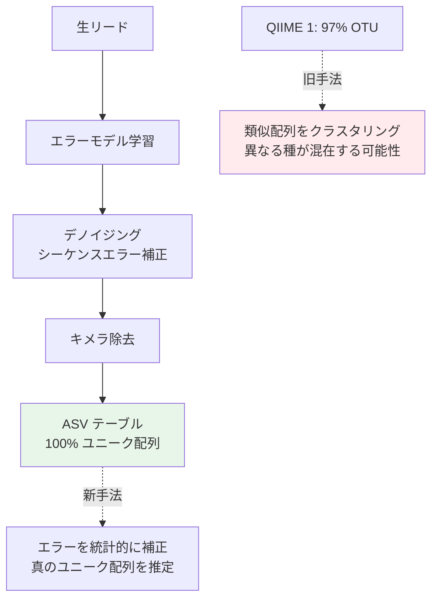

# 2. クオリティーコントロール・マージ（DADA2）

下記コマンドでプライマー配列の削除、3′末端配列の削除、デノイジング、R1・R2リードのマージ、phiX配列の削除、キメラ配列の削除が行われる。

## DADA2 の概要

デノイジングはQIIME 2 で新たに導入された処理である。Illumina シーケンサーのエラー率やエラーが起こる塩基パターンについて膨大なデータがある。そのデータをもとにエラーの数理モデルを構築し、シーケンスのエラーを補正することができる。このデノイジングによって、QIIME 2 ではQIIME 1 よりもOTU数が非常に少なくなっている。



### OTU vs ASV

QIIME 1 では似た配列（97%の同一性）をまとめて1つの細菌種のようにみなす「OTU」の考え方を採用していた。しかし、この方法では本来は別の細菌種である似た配列が同じOTUに含まれてしまう問題があった。

DADA2 はエラーを機械学習によって取り除くことで、この問題を解決する。そのため、QIIME 2 ではOTUという考え方はせず、代表配列はユニーク配列＝100% OTU である。DADA2 の結果求められる配列のセットを**「amplicon sequence variant (ASV)」**と呼ぶ。

> 参考: DADA2 原著論文 Fig. S1 — [Callahan et al., Nature Methods, 2016](https://www.nature.com/articles/nmeth.3869)

## 2.1 DADA2 デノイジングの実行

### 通常サンプル

```bash
qiime dada2 denoise-paired \
  --i-demultiplexed-seqs demux.qza \
  --p-trim-left-f 20 \
  --p-trim-left-r 19 \
  --p-trunc-len-f 280 \
  --p-trunc-len-r 210 \
  --o-table table1.qza \
  --o-representative-sequences rep-seqs1.qza \
  --o-denoising-stats denoising-stats1.qza \
  --p-n-threads 0
```

### 3塩基タグ付きサンプルの場合

タグの分も余分に削る必要がある（残っていたとしてもプライマー配列で増幅させている部分＝その細菌が持っている配列なので結果に大きな影響はない）。

```bash
qiime dada2 denoise-paired \
  --i-demultiplexed-seqs demux.qza \
  --p-trim-left-f 23 \
  --p-trim-left-r 22 \
  --p-trunc-len-f 283 \
  --p-trunc-len-r 213 \
  --o-table table.qza \
  --o-representative-sequences rep-seqs.qza \
  --o-denoising-stats denoising-stats.qza \
  --p-n-threads 0
```

| パラメータ | 説明 |
|-----------|------|
| `--i-demultiplexed-seqs` | インプットファイル名 |
| `--p-trim-left-f (r)` | Forward (Reverse) read の5′末端から削る塩基数 |
| `--p-trunc-len-f (r)` | Forward (Reverse) read の5′末端から残す塩基数 |
| `--o-table` | 出力するtableファイル名 |
| `--o-representative-sequences` | 出力する代表配列ファイル名 |
| `--o-denoising-stats` | 出力するQC結果ファイル名 |
| `--p-n-threads` | 使用スレッド数（0 = 最大スレッド数） |

> **⚠️ パラメータの注意**  
> - R1 では281塩基以降、R2 では211塩基以降を削除しているが、これはQ-scoreの第3四分位が25以上になることを目安にしている
> - **毎回のランでQ-scoreプロファイルを確認し、必要に応じてパラメータを調整すること**。上記値は当ラボのルーチン解析における目安であり、固定値として使うべきではない

## 2.2 注意：異なるRunサンプルのデノイジング

DADA2 はRun間で生じるシーケンスバイアスも補正するため、**基本的には1度のRunのサンプルに対して使用する**。

> QIIME 2 チュートリアルより:  
> *"The DADA2 denoising process is only applicable to a single sequencing run at a time, so we need to run this on a per sequencing run basis and then merge the results."*

対応として、Runごとに別々にdenoisingをかけてそれをmergeすれば良い。詳細は [17. マルチラン処理](17_multi_run.md) を参照。

---

**次のセクション**: [03. QC結果の可視化](04_visualization.md)
