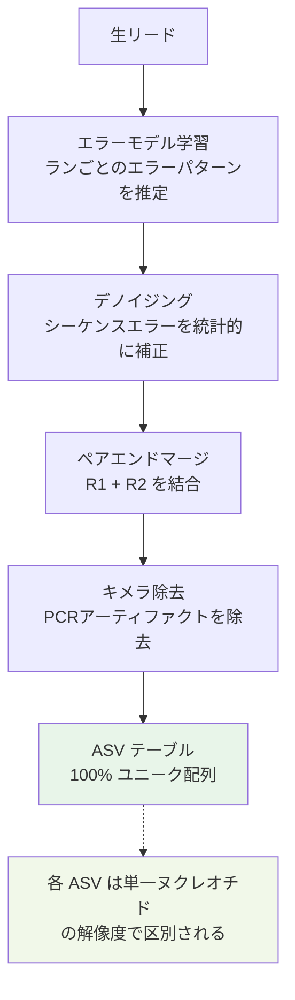

# 2. クオリティーコントロール・マージ（DADA2）

下記コマンドでプライマー配列の削除、3′末端配列の削除、デノイジング、R1・R2リードのマージ、phiX配列の削除、キメラ配列の削除が行われる。

## DADA2 の概要

DADA2（Divisive Amplicon Denoising Algorithm 2）は、Illumina シーケンサーが生成するシーケンシングエラーを統計的に補正するためのアルゴリズムである。QIIME 2 でデノイジングとして利用されるこの手法は、単なるクオリティフィルタリングとは根本的に異なる。

### エラーモデルの学習

DADA2 はまず入力データからシーケンシングエラーのパターンを学習する。具体的には「ある塩基が別の塩基に読み間違えられる確率」を各ランのデータから推定する（**エラーモデル**）。このモデルは実験ごとに異なるため、DADA2 は原則として**1ランのデータに対して1回**適用する必要がある（後述）。

### ASV（Amplicon Sequence Variant）の概念

エラーモデルを構築したあと、DADA2 は各リードが「真の生物学的配列」か「シーケンシングエラーから生じた配列」かを確率的に判定する。これにより得られるユニーク配列セットを **ASV（Amplicon Sequence Variant）** と呼ぶ。



### OTU vs ASV

QIIME 1 では似た配列（97%の同一性）をまとめて1つの細菌種のようにみなす「OTU」の考え方を採用していた。しかし、この方法では本来は別の細菌種である似た配列が同じOTUに含まれてしまう問題があった。

DADA2 はエラーを機械学習によって取り除くことで、この問題を解決する。そのため、QIIME 2 ではOTUという考え方はせず、代表配列はユニーク配列＝100% OTU である。DADA2 の結果求められる配列のセットを**「amplicon sequence variant (ASV)」**と呼ぶ。

> 参考: DADA2 原著論文 Fig. S1 — [Callahan et al., Nature Methods, 2016](https://www.nature.com/articles/nmeth.3869)

## DADA2 のメリット・デメリット

DADA2 は現在最も広く使われるデノイジング手法だが、代替手法（Deblur など）も存在する。適切な手法を選択するために特性を理解しておく。

### メリット

| 特徴 | 説明 |
|------|------|
| **単一ヌクレオチド解像度** | 97% OTU と異なり、1塩基の違いで別の ASV として区別される。近縁種の識別精度が高い |
| **エラー補正** | 確率モデルに基づきシーケンシングエラーを補正するため、偽陽性のユニーク配列が少ない |
| **キメラ除去の統合** | PCR アーティファクトであるキメラ配列の除去が同一パイプライン内で行われる |
| **再現性** | 同じ入力データと同じパラメータを使えば常に同じ結果が得られる |

### デメリット

| 特徴 | 説明 |
|------|------|
| **ラン特異性** | エラーモデルはラン（シーケンシングバッチ）ごとに学習されるため、異なるランのサンプルをデノイジング前にマージすることができない。複数ランのデータを統合する場合は、ランごとにデノイジングしたあとにテーブルをマージする |
| **計算コスト** | サンプル数が多い場合や大規模データでは処理時間が長くなる。マルチスレッドの活用（`--p-n-threads 0`）を推奨 |
| **積極的なフィルタリング** | エラー補正が厳しすぎると、真の生物学的バリアントが除去されることがある。パラメータ調整が必要 |

> **代替手法**: Deblur（`qiime deblur denoise-16S`）も QIIME 2 で利用可能なデノイジング手法である。シングルエンドのみ対応だが、より速い場合がある。用途に応じて検討されたい。

## 2.1 DADA2 デノイジングの実行

### 通常サンプル

```bash
qiime dada2 denoise-paired \
  --i-demultiplexed-seqs demux.qza \
  --p-trim-left-f 20 \
  --p-trim-left-r 19 \
  --p-trunc-len-f 280 \
  --p-trunc-len-r 210 \
  --o-table table1.qza \
  --o-representative-sequences rep-seqs1.qza \
  --o-denoising-stats denoising-stats1.qza \
  --p-n-threads 0
```

### 3塩基タグ付きサンプルの場合

タグの分も余分に削る必要がある（残っていたとしてもプライマー配列で増幅させている部分＝その細菌が持っている配列なので結果に大きな影響はない）。

```bash
qiime dada2 denoise-paired \
  --i-demultiplexed-seqs demux.qza \
  --p-trim-left-f 23 \
  --p-trim-left-r 22 \
  --p-trunc-len-f 283 \
  --p-trunc-len-r 213 \
  --o-table table.qza \
  --o-representative-sequences rep-seqs.qza \
  --o-denoising-stats denoising-stats.qza \
  --p-n-threads 0
```

### パラメータ一覧

| パラメータ | 説明 |
|-----------|------|
| `--i-demultiplexed-seqs` | インプットファイル名 |
| `--p-trim-left-f (r)` | Forward (Reverse) read の5′末端から削る塩基数 |
| `--p-trunc-len-f (r)` | Forward (Reverse) read の5′末端から残す塩基数 |
| `--o-table` | 出力するtableファイル名 |
| `--o-representative-sequences` | 出力する代表配列ファイル名 |
| `--o-denoising-stats` | 出力するQC結果ファイル名 |
| `--p-n-threads` | 使用スレッド数（0 = 最大スレッド数） |

> **パラメータの注意**
> - R1 では281塩基以降、R2 では211塩基以降を削除しているが、これはQ-scoreの第3四分位が25以上になることを目安にしている
> - **毎回のランでQ-scoreプロファイルを確認し、必要に応じてパラメータを調整すること**。上記値は当ラボのルーチン解析における目安であり、固定値として使うべきではない

### 2025.7+ で追加されたパラメータ

2025.7 リリースより `denoise-paired` に以下のパラメータが追加された。

| パラメータ | デフォルト値 | 説明 |
|-----------|------------|------|
| `--p-max-mismatch` | 0 | ペアエンドマージ時に許容するミスマッチ塩基数。デフォルトは0（完全一致）。低クオリティリードが多い場合に少し増やすことを検討できる |
| `--p-trim-overhang` | False | R1/R2 のオーバーハング部分（一方のリードが他方を超えた領域）をトリムするかどうか。アンプリコンが短い場合に有用 |

```bash
# 例: マージ品質が低い場合のパラメータ調整
qiime dada2 denoise-paired \
  --i-demultiplexed-seqs demux.qza \
  --p-trim-left-f 20 \
  --p-trim-left-r 19 \
  --p-trunc-len-f 280 \
  --p-trunc-len-r 210 \
  --p-max-mismatch 1 \
  --p-trim-overhang True \
  --o-table table.qza \
  --o-representative-sequences rep-seqs.qza \
  --o-denoising-stats denoising-stats.qza \
  --p-n-threads 0
```

### パラメータ名の変更（2025.4+）

2025.4 以前では `--p-n-reads-learn`（エラーモデル学習に使用するリード数）というパラメータが存在したが、2025.4 以降は `--p-n-bases-learn`（学習に使用する塩基数）にリネームされた。古いスクリプトを再実行する場合は注意が必要である。

## 2.2 エラーモデルの可視化（2025.10+）

2025.10 リリースより、DADA2 が推定したエラーモデルを可視化する `plot-base-transitions` コマンドが追加された。各塩基の誤読パターン（エラープロファイル）を確認することで、デノイジングが適切に機能しているかを検証できる。

```bash
qiime dada2 plot-base-transitions \
  --i-denoising-stats denoising-stats.qza \
  --o-visualization dada2-error-profile.qzv
```

この可視化では、Q-score と観察されるエラー率の関係がプロットされる。学習されたモデル（曲線）が実データの観察値とよく一致していれば、エラーモデルの学習が適切に行われたと判断できる。

> **使用目的**: エラーモデルの可視化はトラブルシューティングに特に有用である。フィルタリングで多くのリードが失われた場合や、ASV 数が予想外に少ない/多い場合は、このプロットを確認することを推奨する。

## 2.3 出力形式の変更（2025.4+）

2025.4 リリースより、`--o-denoising-stats` の出力型が `DADA2Stats` から `Collection[DADA2Stats]` に変更された。通常の解析ワークフローに対する影響は小さいが、以前のバージョンで作成した `.qza` を使い回す場合や、Python API で型を直接参照している場合は注意が必要である。

## 2.4 注意：異なるRunサンプルのデノイジング

DADA2 はRun間で生じるシーケンスバイアスも補正するため、**基本的には1度のRunのサンプルに対して使用する**。

> QIIME 2 チュートリアルより:
> *"The DADA2 denoising process is only applicable to a single sequencing run at a time, so we need to run this on a per sequencing run basis and then merge the results."*

対応として、Runごとに別々にdenoisingをかけてそれをmergeすれば良い。詳細は [17. マルチラン処理](17_multi_run.md) を参照。

---

**次のセクション**: [03. QC結果の可視化](04_visualization.md)
