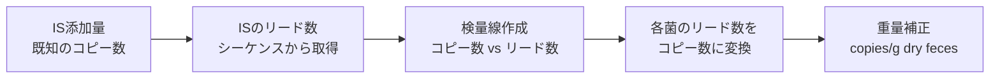

# 16. 検量線の作成・コピー数（細菌数）の定量

> ISのある状態のリード数から検量線を求めて、ISを抜いた後のリード数に適用する。

## 定量の原理



## 手順

### 1. ISのリード数を抽出

`feature-table_cn.txt` から各サンプルの Salinibacterium、Agrobacterium（Rhizobium）のリード数を抽出する。

### 2. IS の理論コピー数

| IS菌種 | 理論コピー数 |
|--------|-------------|
| Salinibacterium | 1.5 × 10⁷ × 添加IS液量 (μL) |
| Agrobacterium (Rhizobium) | 5 × 10⁷ × 添加IS液量 (μL) |

### 3. 検量線（線形回帰）の作成

**方法A: Excelのグラフ機能**

コピー数をx軸、リード数をy軸として散布図を描き、近似曲線の追加で線形近似を選択して切片を原点にする。

**方法B: ExcelのLINEST関数**

```
線形近似曲線の傾き = LINEST(y軸の値, x軸の値, 0, 0)
```

例えば、10.0 mg の糞便に対して 10.0 μL のIS溶液を添加した場合：

| 軸 | 値 |
|---|---|
| x軸（コピー数） | (0, 150000000, 500000000) |
| y軸（リード数） | (0, Salinibacteriumのリード数, Agrobacteriumのリード数) |

### 4. コピー数の算出

```
コピー数 = リード数 ÷ 傾き
```

### 5. 重量補正

```
正規化コピー数 = (リード数 ÷ 傾き) ÷ 実測重量(mg) × 1000
```

単位: **Normalized 16S rRNA gene abundance (copies/g dry feces)**

> **Note**: 実際の重量は通常 9.5mg〜10.5mg なので、測定した実際の重さで割り算する。

### 6. R² 値の算出

Excel の LINEST 関数と INDEX 関数を組み合わせて求める：

```
R² = INDEX(LINEST(y軸の値, x軸の値, 1, 1), 3, 1)
```

> **⚠️ 注意**: この R² は切片を0にしない場合の値なので、グラフで算出した値とは微妙にずれる。

---

**次のセクション**: [15. ネガティブコントロール除去](15_negative_control.md)
