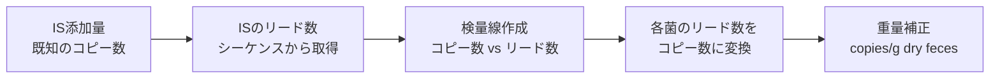

# 14. 検量線の作成・コピー数（細菌数）の定量

> ISのある状態のリード数から検量線を求めて、ISを抜いた後のリード数に適用する。

## 概要：相対存在量 vs 絶対定量

### 相対存在量とは

通常の16Sアンプリコン解析で得られるのは「相対存在量」である。これは各ASVのリード数をサンプル内の総リード数で割った割合（%）であり、以下の問題がある。

- **Compositional artifact**: サンプル内の割合は常に合計100%になる。A菌が真に増えていなくても、B菌が増えればA菌の相対量は自動的に下がる。介入実験や疾患研究では、この見かけ上の変化が誤った解釈を招くことがある。
- **サンプル間の菌量比較ができない**: 相対量10%のサンプルAと10%のサンプルBが同じ菌量かどうかはわからない。

### 絶対定量とは

ISを使うことで、各菌の実際のコピー数（copies/g dry weight など）を算出できる。これが絶対定量であり、真の増減を反映する。

## 絶対定量のメリット・デメリット

### メリット

- **生物学的に意義のある値**: copies/g dry feces のような実量値は、直感的に解釈しやすく他研究との比較も容易
- **Compositional artifact の回避**: 各菌の量が独立して評価されるため、他の菌の変動に引きずられない
- **菌量の増減を正確に評価**: 介入前後で特定の菌が実際に何倍になったか、あるいは消えたかを定量できる
- **異なるサンプル間のバクテリアルロードの比較が可能**

### デメリット

- **ISウェットラボプロトコルが必要**: 全サンプルへの均一なIS添加が前提であり、実験室インフラと熟練度が求められる
- **検量線の精度依存**: IS添加量のばらつきや検量線の品質が定量精度に直結する
- **ISインフラのない施設では利用困難**: 既存データへの遡及適用はできない

---

## 定量の原理



## 手順

### 1. ISのリード数を抽出

`feature-table_cn.txt` から各サンプルの Salinibacterium、Agrobacterium（Rhizobium）のリード数を抽出する。

### 2. IS の理論コピー数

| IS菌種 | 理論コピー数 |
|--------|-------------|
| Salinibacterium | 1.5 × 10⁷ × 添加IS液量 (μL) |
| Agrobacterium (Rhizobium) | 5 × 10⁷ × 添加IS液量 (μL) |

### 3. 検量線（線形回帰）の作成

**方法A: Excelのグラフ機能**

コピー数をx軸、リード数をy軸として散布図を描き、近似曲線の追加で線形近似を選択して切片を原点にする。

**方法B: ExcelのLINEST関数**

```
線形近似曲線の傾き = LINEST(y軸の値, x軸の値, 0, 0)
```

例えば、10.0 mg の糞便に対して 10.0 μL のIS溶液を添加した場合：

| 軸 | 値 |
|---|---|
| x軸（コピー数） | (0, 150000000, 500000000) |
| y軸（リード数） | (0, Salinibacteriumのリード数, Agrobacteriumのリード数) |

### 4. コピー数の算出

```
コピー数 = リード数 ÷ 傾き
```

### 5. 重量補正

```
正規化コピー数 = (リード数 ÷ 傾き) ÷ 実測重量(mg) × 1000
```

単位: **Normalized 16S rRNA gene abundance (copies/g dry feces)**

> **Note**: 実際の重量は通常 9.5mg〜10.5mg なので、測定した実際の重さで割り算する。

### 6. R² 値の算出

Excel の LINEST 関数と INDEX 関数を組み合わせて求める：

```
R² = INDEX(LINEST(y軸の値, x軸の値, 1, 1), 3, 1)
```

> **⚠️ 注意**: この R² は切片を0にしない場合の値なので、グラフで算出した値とは微妙にずれる。

---

## 代替手法の紹介

ISを使わない絶対定量の代替手法として、以下のアプローチが存在する。これらは異なるバイアスを持つため、研究目的・施設環境に応じて選択する。

### フローサイトメトリーによる総菌数計測

SYBR Greenなどの蛍光色素でDNAを染色した後、フローサイトメーターで総菌数を計測する。得られた総菌数をアンプリコン解析の相対存在量に乗じることで絶対定量値を算出できる。ただし、死菌・生菌を区別しない点や、夾雑物（食物繊維など）が計測を妨害するケースがある。

### qPCRによる総16S rRNAコピー数の定量

ユニバーサルプライマーを用いた定量PCR（qPCR）で、サンプル中の総16S rRNAコピー数を定量する。相対存在量と組み合わせることで各菌の絶対量を算出できる。PCR効率の変動やプライマーバイアスに注意が必要であり、標準曲線の精度管理が重要となる。

### 各手法の比較

| 手法 | コスト | ウェットラボの複雑さ | 主なバイアス |
|------|--------|---------------------|-------------|
| IS法（本章） | 中 | 中（IS添加が必要） | IS添加量のばらつき |
| フローサイトメトリー | 高 | 高（専用機器が必要） | 夾雑物、染色効率 |
| qPCR（総16S） | 低〜中 | 低〜中 | PCR効率、プライマーバイアス |

---

**次のセクション**: [15. ネガティブコントロール除去](15_negative_control.md)
