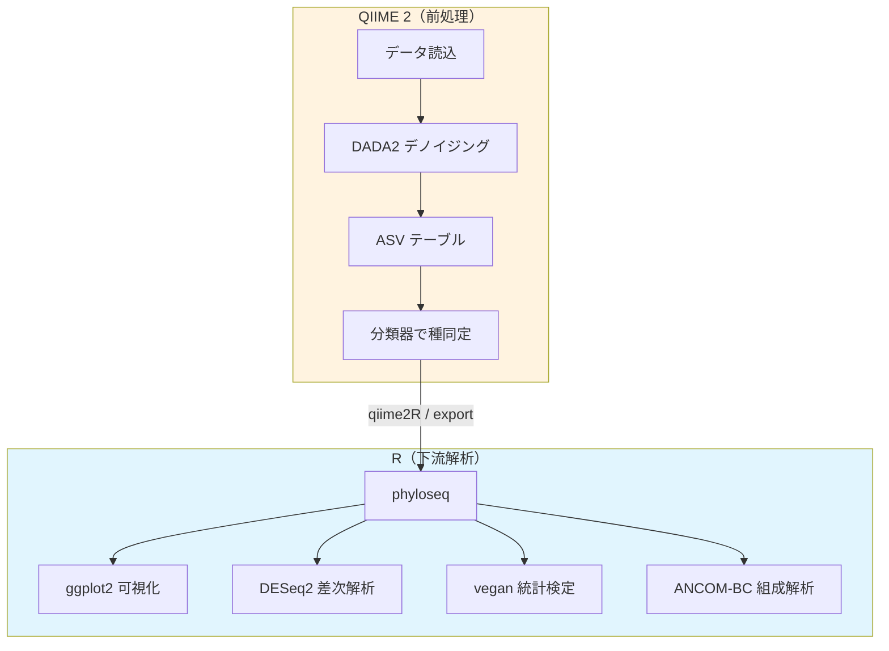

# 18. R / phyloseq へのエクスポート（NEW）

> **本セクションは新規追加**。QIIME 2 でASVテーブルと分類結果まで生成した後、下流の解析をRで行うハイブリッドワークフローを記載する。

## なぜRで解析するのか



Rで解析を行うメリット：
- **ggplot2** による柔軟で美しい可視化
- **DESeq2 / ANCOM-BC / ALDEx2** などの組成データ解析手法が利用可能
- **vegan** パッケージによる豊富な統計手法
- **phyloseq** による統一的なデータ操作
- 論文品質の図表を直接出力可能

## 方法A: qiime2R パッケージ（推奨）

`.qza` ファイルをRに直接読み込める。

### R側の準備

```r
# qiime2R のインストール（初回のみ）
if (!requireNamespace("devtools", quietly = TRUE))
  install.packages("devtools")
devtools::install_github("jbisanz/qiime2R")

# その他必要パッケージ
install.packages(c("tidyverse", "vegan"))
if (!requireNamespace("BiocManager", quietly = TRUE))
  install.packages("BiocManager")
BiocManager::install(c("phyloseq", "DESeq2"))
```

### QIIME 2 データの読み込み

```r
library(qiime2R)
library(phyloseq)

# phyloseq オブジェクトの作成（一発で完了）
ps <- qza_to_phyloseq(
  features = "filterIS/table_filterIS.qza",
  tree = "filterIS/phylogeny/rooted-tree_filterIS.qza",
  taxonomy = "taxonomy/rep-seqs_classified.qza",
  metadata = "sample-metadata_cn.txt"
)

# 確認
ps
```

## 方法B: QIIME 2 エクスポート → R で読み込み

```bash
# QIIME 2 側：各ファイルをエクスポート
# ASV テーブル（BIOM形式）
qiime tools export \
  --input-path filterIS/table_filterIS.qza \
  --output-path export/
mv export/feature-table.biom export/table.biom

# Taxonomy
qiime tools export \
  --input-path taxonomy/rep-seqs_classified.qza \
  --output-path export/

# 系統樹
qiime tools export \
  --input-path filterIS/phylogeny/rooted-tree_filterIS.qza \
  --output-path export/
```

```r
# R側
library(phyloseq)
library(biomformat)

# 読み込み
biom <- read_biom("export/table.biom")
otu_table <- otu_table(as(biom_data(biom), "matrix"), taxa_are_rows = TRUE)

tax <- read.delim("export/taxonomy.tsv", row.names = 1)
# 分類階層を列に分割
tax_split <- do.call(rbind, strsplit(tax$Taxon, "; "))
colnames(tax_split) <- c("Kingdom", "Phylum", "Class", "Order", "Family", "Genus", "Species")
tax_table <- tax_table(as.matrix(tax_split))

tree <- read_tree("export/tree.nwk")
metadata <- import_qiime_sample_data("sample-metadata_cn.txt")

ps <- phyloseq(otu_table, tax_table, tree, metadata)
```

## R での基本解析例

### α多様性

```r
library(ggplot2)

# Shannon 多様性の箱ひげ図
plot_richness(ps, x = "Group", measures = c("Shannon", "Chao1")) +
  geom_boxplot() +
  theme_bw()
```

### β多様性（PCoA）

```r
ord <- ordinate(ps, method = "PCoA", distance = "unifrac", weighted = TRUE)
plot_ordination(ps, ord, color = "Group") +
  stat_ellipse() +
  theme_bw()
```

### 組成棒グラフ

```r
# 属レベルで集約
ps_genus <- tax_glom(ps, taxrank = "Genus")
ps_rel <- transform_sample_counts(ps_genus, function(x) x / sum(x))

plot_bar(ps_rel, fill = "Genus") +
  theme_bw()
```

## 組成データ解析に関する注意

> **⚠️ 重要**: 相対存在量（relative abundance）に基づく解析は、少数菌の変動が過大評価される「見かけの変化（compositional artifact）」の問題がある。

推奨される現代的手法：
- **ANCOM-BC**: 組成バイアスを補正した差次的存在量解析
- **ALDEx2**: CLR変換を用いた差次的存在量解析
- **CLR変換**: centered log-ratio 変換により組成データの問題を軽減

```r
# ANCOM-BC の例
BiocManager::install("ANCOMBC")
library(ANCOMBC)

result <- ancombc2(
  data = ps,
  fix_formula = "Group",
  p_adj_method = "BH"
)
```

---

**次のセクション**: [19. ユーティリティ](19_utilities.md)
